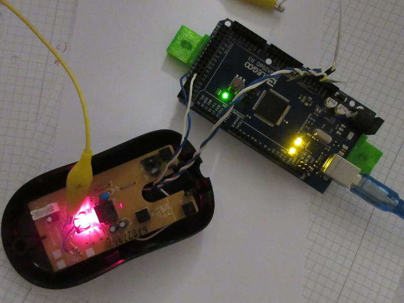

# mouse-scanner

An optical mouse uses a camera to track its movements on the surface (i.e. a mousepad) below. Some sensors offer the possibility to not just read the movement data of the two axes, but also the raw pixel data and other diagnostic values.

The sensor used here is a relabled Agilent ADNS2620 sensor from a Microsoft Basic Optical Mouse 1.0A. After connecting the two pins of the sensors serial port (you can find the datasheet online) to an arduino the pixel data can be retrieved.

The image is 18x18 pixels in size and only one pixel can be read at a time. Every color value of a pixel is six bits wide, giving 64 distinct shades of gray. After reading all the data of a whole image, the arduino sends it as a hex-encoded string of data via its serial port to the computer. The python script uses the pillow library to save the data to a png file. It must be invoked with the full path to the serial device (should be "/dev/ttyACM0" in most cases).

The area covered by the sensor is surprisingly small. It is only about 1x1 mm.
